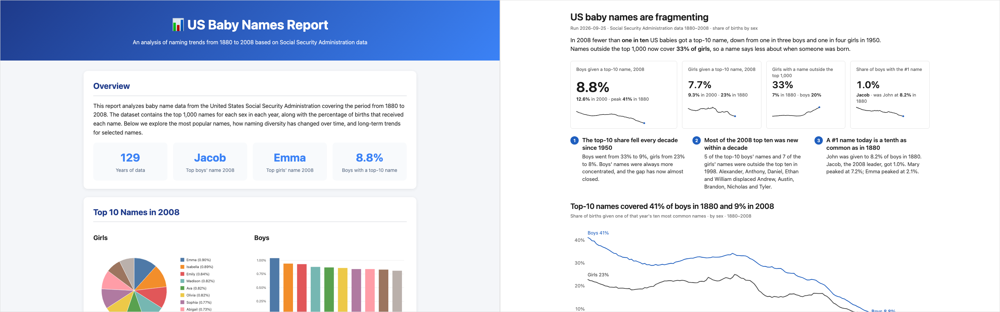

# infographics

A Claude Code skill: page-level design principles for reports, dashboards and
infographics that busy, non-technical readers must grasp in five seconds.

Same data, same numbers. Left without the skill, right with it.



Distilled from Tufte (data-ink, small multiples, sparklines), Few (single screen,
context beside every number), Knaflic (action titles, one highlight colour) and
Cairo (truthful before beautiful). Tool-agnostic: applies to HTML, slides, PDF,
Markdown, notebooks and BI dashboards.

It covers the page around the charts. For colour validation and mark specs inside
a single chart, use Claude's built-in `dataviz` skill alongside it.

## Install

As a plugin, with updates:

```
/plugin marketplace add Temikus/claude-plugins
/plugin install infographics@temikus
```

As a project skill, versioned with your repo:

```
git clone https://github.com/Temikus/claude-skill-infographics /tmp/infographics
cp -R /tmp/infographics/plugin/skills/infographics .claude/skills/
```

As a personal skill:

```
cp -R plugin/skills/infographics ~/.claude/skills/
```

## Use

Triggers on requests to make a report, dashboard or summary "scannable", "at a
glance", "for Finance", "for leadership" or infographic-like. Invoke directly with
`/infographics`.

## Example

[examples/README.md](examples/README.md) has the full-page renders of both pages
above and how to rebuild them.

## Layout

```
plugin/                       what `/plugin install` fetches (git-subdir source)
  .claude-plugin/plugin.json
  skills/infographics/
    SKILL.md                  procedure, chart-per-question table, checklist
    references/principles.md  the principles, how each was applied, sources
examples/baby-names/          with-skill and without-skill pages, build scripts, screenshots
```

`just examples` rebuilds the example pages and screenshots.

## License

Apache-2.0
