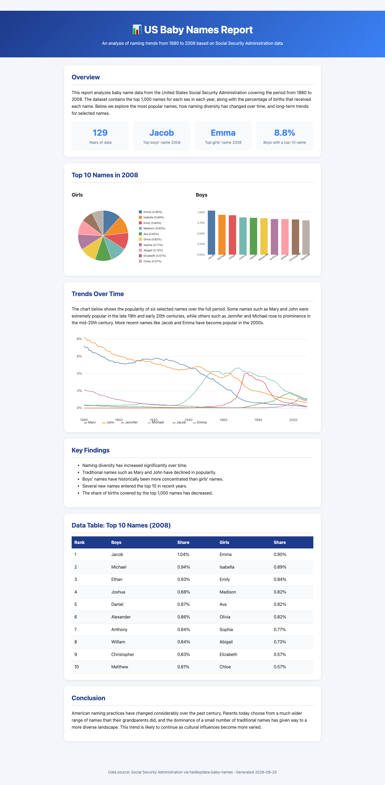
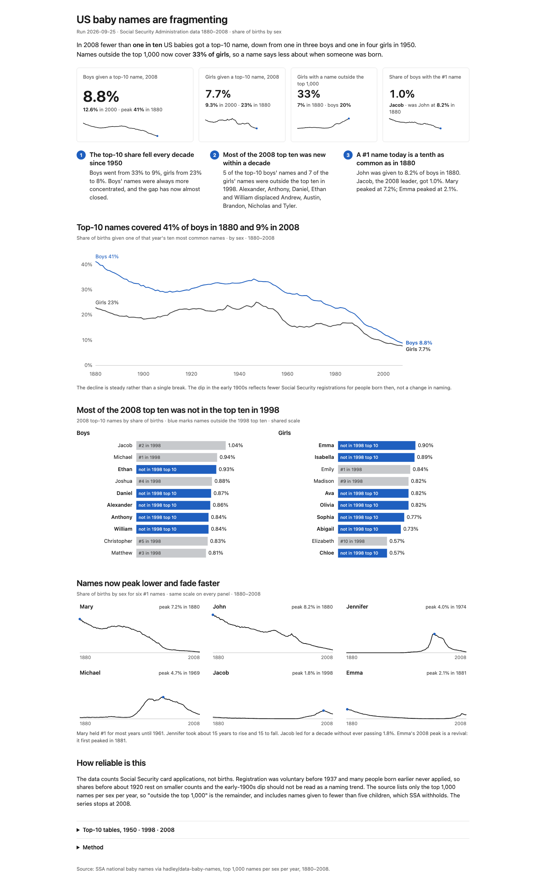

# Examples

Side-by-side renders of the same data and numbers, with and without the skill.

## baby-names

US Social Security Administration baby names, 1880-2008 (top 1,000 names per sex
per year, via [hadley/data-baby-names](https://github.com/hadley/data-baby-names)).

| Without the skill | With the skill |
|---|---|
|  |  |

Above the fold at 1440x900:


Both pages are built from the same `data.json` by `build.py`. The left page is a
plausible default: topic headings, an overview paragraph, a pie with a legend, a
multi-colour line chart, bullet findings without numbers, a table. The right page
follows the skill's procedure: lede, hero number with sparkline and comparison,
three numbered takeaways, action titles, one highlight colour, direct labels, a
reliability paragraph, detail collapsed.

Rebuild:

```
python3 prepare.py     # fetch source CSV and write data.json (cached in .cache/)
python3 build.py       # write with-skill.html and without-skill.html
./screenshot.sh        # headless Chrome + ImageMagick: *-fold.png, *-full.png, side-by-side.png
```
